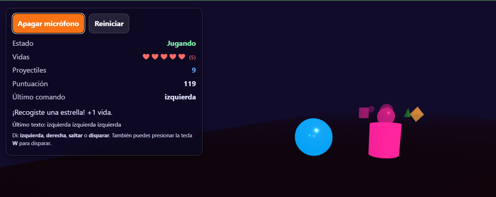

# 🎮 Juego VR Controlado por Voz (A-Frame + React)

Un emocionante juego de supervivencia (estilo *endless runner*) en 3D y Realidad Virtual, construido con **React / Next.js** y **A-Frame**. La característica principal de este juego es que **se controla completamente con tu voz** utilizando la Web Speech API en tiempo real.



## ✨ Características Principales

* 🎙️ **Control por Voz Ultra Rápido:** Utiliza procesamiento de resultados provisionales (`interimResults`) y coincidencia de subcadenas para reaccionar a tus comandos en fracciones de segundo, antes de que termines de pronunciar la palabra.
* 🕶️ **Entorno 3D y VR:** Renderizado fluido en el navegador gracias a A-Frame.
* 🏃‍♂️ **Mecánicas de Esquiva y Disparo:** Muévete entre 3 carriles, salta sobre obstáculos o destrúyelos con proyectiles.
* ⭐ **Coleccionables:** Recoge **Estrellas** para ganar vidas extra y **Pirámides** para recargar tu munición.
* 📈 **Dificultad Progresiva:** La velocidad del juego aumenta a medida que sobrevives más tiempo.

## 🗣️ Comandos de Voz

Asegúrate de dar permisos de micrófono en tu navegador. El juego está configurado para reconocer español (`es-MX`). Los comandos disponibles son:

* **"Izquierda"**: Mueve al jugador al carril izquierdo.
* **"Derecha"**: Mueve al jugador al carril derecho.
* **"Saltar"**: Realiza un salto largo para esquivar obstáculos por arriba (ideal para cuando no tienes munición).
* **"Disparar"** o **"Fuego"**: Lanza un proyectil hacia adelante para destruir el obstáculo que viene en tu carril.

*(Nota: También puedes presionar la tecla **W** en tu teclado como atajo alternativo para disparar).*

## 🧩 Elementos del Juego


| Objeto         | Color/Forma                   | Función                                              |
| :------------- | :---------------------------- | :---------------------------------------------------- |
| **Jugador**    | 🔵 Esfera azul                | Eres tú. Cambia si recibes daño.                    |
| **Obstáculo** | 🛢Rosa (Cubo/Esfera/Cilindro) | Evítalos o destrúyelos. Te quitan 1 vida si chocas. |
| **Estrella**   | 🟡 Octaedro Amarillo          | **+1 Vida** (Máximo 5 vidas).                        |
| **Pirámide**  | 🟢 Cono Verde                 | **+6 Proyectiles** de munición.                      |
| **Proyectil**  | 🔴 Esfera Roja                | Destruye un obstáculo en tu camino.                  |

## 🚀 Instalación y Uso

Este componente está diseñado para funcionar en un entorno de **Next.js** (App Router o Pages Router).

1. **Clona el repositorio** o crea un nuevo proyecto de Next.js:

   ```bash
   npx create-next-app@latest mi-juego-vr
   cd mi-juego-vr
   ```
2. **Copia el código:**
   Crea un archivo llamado `VRScene.tsx` (o `.jsx`) en tu carpeta de componentes y pega el código del juego.
3. **Importa el componente:**
   En tu página principal (ej. `app/page.tsx`), importa y renderiza el componente:

   ```tsx
   import VRScene from './components/VRScene';

   export default function Home() {
     return (
       <main>
         <VRScene />
       </main>
     );
   }
   ```
4. **Inicia el servidor de desarrollo:**

   ```bash
   npm run dev
   ```
5. **Abre el juego:**
   Ve a `http://localhost:3000` en tu navegador.
   *⚠️ Importante:* Se recomienda encarecidamente usar **Google Chrome** o **Microsoft Edge**, ya que tienen el mejor soporte nativo para la `Web Speech API`.

## 🛠️ Tecnologías Utilizadas

* **React:** Para el manejo del estado (vidas, puntuación, munición) y el ciclo de vida de los elementos.
* **Next.js (`next/script`):** Para inyectar la librería de A-Frame de forma optimizada.
* **A-Frame (`aframe.io`):** Framework web para construir experiencias de realidad virtual (WebVR/WebXR) usando HTML.
* **Web Speech API (`SpeechRecognition`):** Para capturar y procesar el audio del micrófono de forma nativa en el navegador sin necesidad de servidores externos.

## ⚙️ Configuración Técnica 

El juego incorpora un debounce inteligente y un escaneo lineal de caracteres (`lastProcessedCharIndexRef`). Esto soluciona el clásico problema de latencia de las APIs de voz en navegadores, permitiendo que el juego lea fragmentos de voz (como *"izquierd..."*) y ejecute la acción instantáneamente sin duplicar movimientos.
